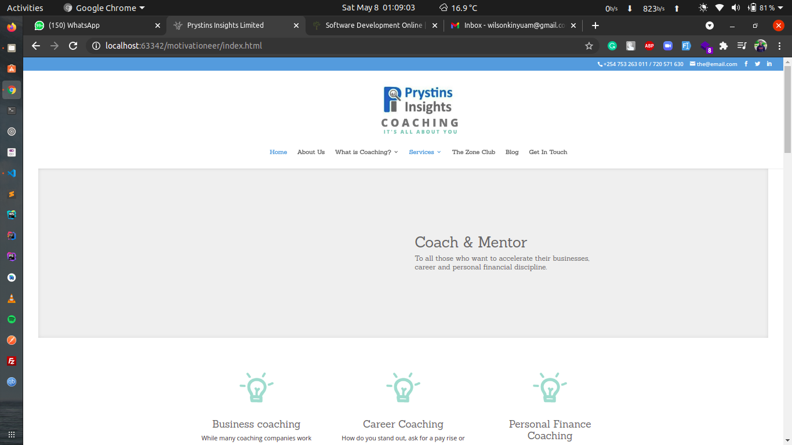
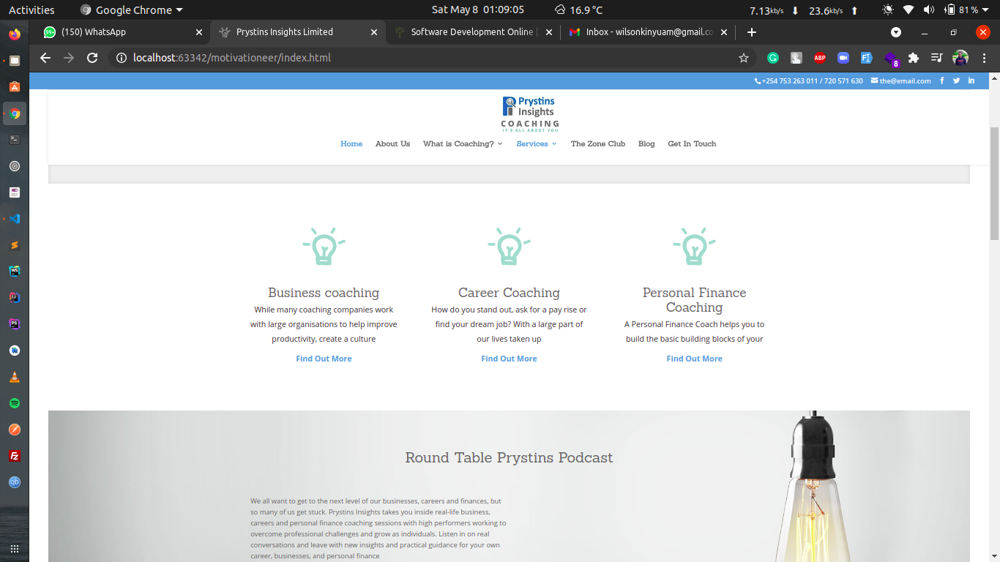
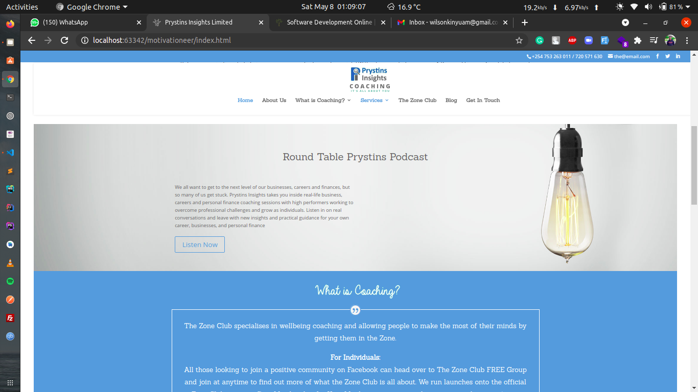
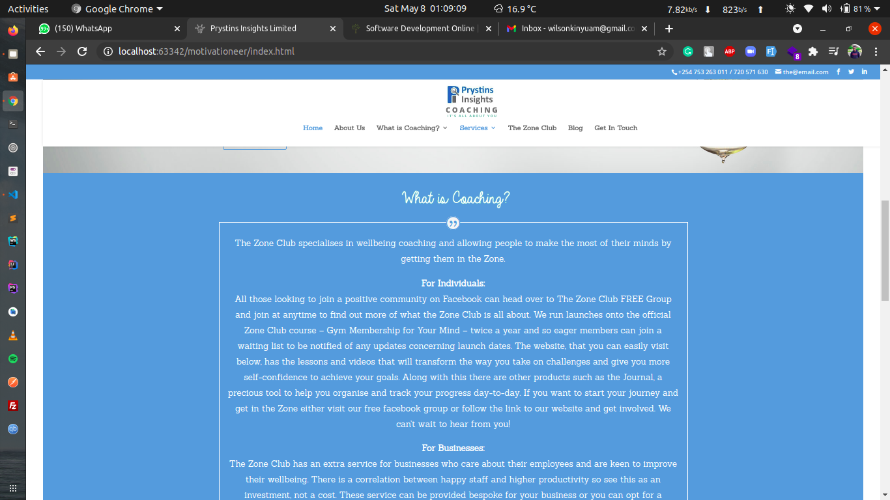
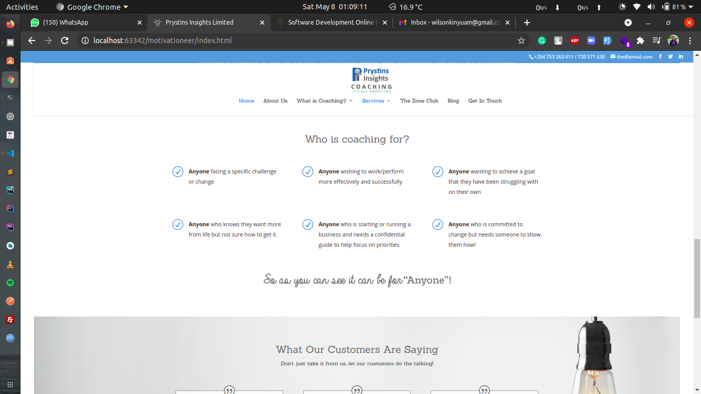
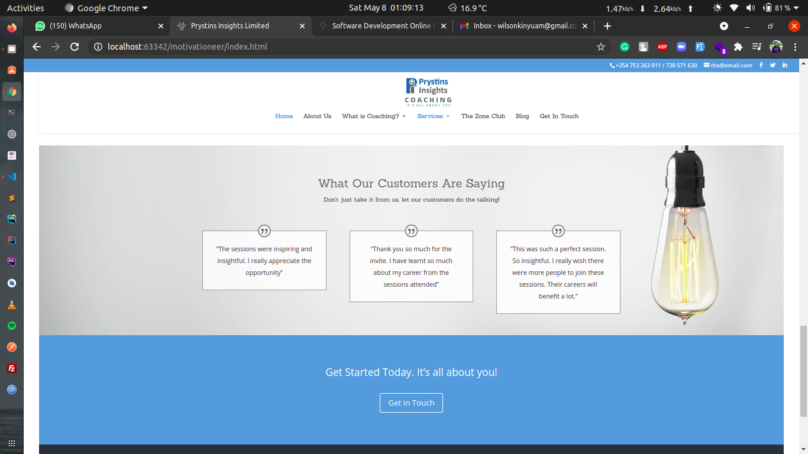
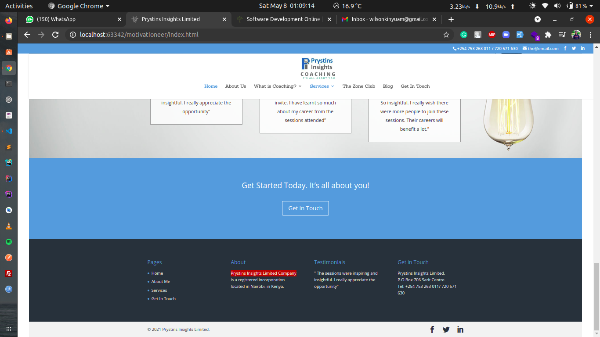
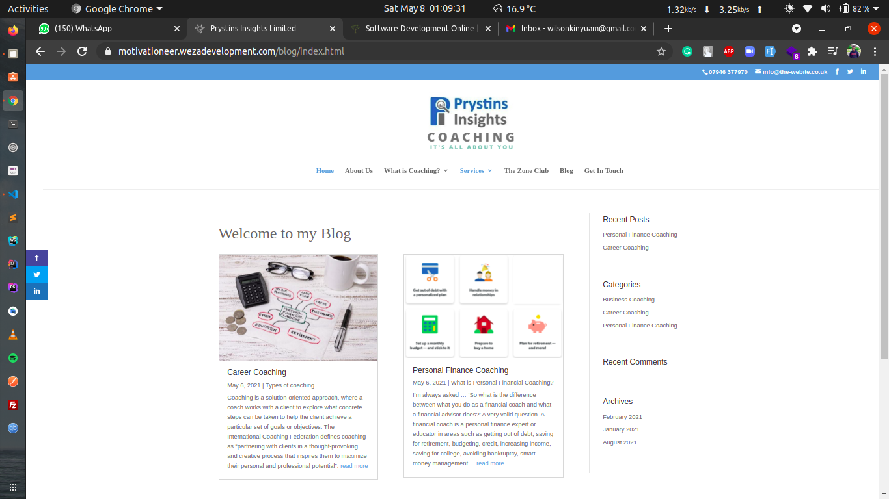
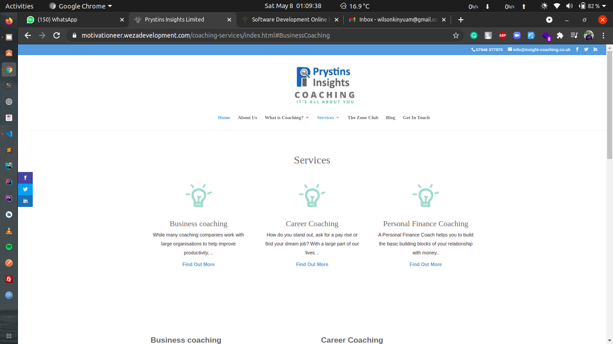

## Prystins Insights Limited Company

## Project setup

## Installation

>Download the compressed folder and place in the folder of your choice😄

>Double click the index.html file which will open browser of your choice🙂

# Happy Coding 😃😃
